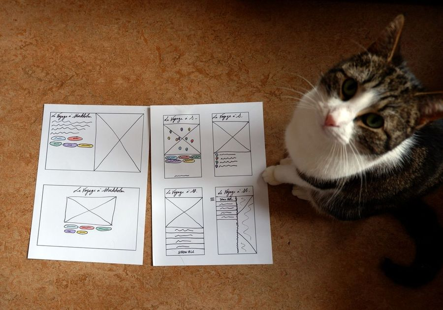

# le-voyage-a-stockholm

A small app to present my favorite places in Stockholm on a map
 |
---|
a creative collaboration with Stormy Cat |

## Built with

### - client-side -

- React
- CSS & SCSS (SASS)
- [@react-google-maps/api](https://www.npmjs.com/package/@react-google-maps/api)

### - server-side -

- Node.js
- Express

### - database -

- MongoDb & Mongoose

### - devops -

- Heroku

## Deployments

[server](https://le-vas-server.herokuapp.com/locations/all)

[client](https://le-voyage-a-stockholm.herokuapp.com/)

## Installation

```bash
# in the server folder
npm i
npm run start # node
#or
npm run dev # nodemon for development purposes

#in the client folder
npm i
npm run start
```

## What I have learned

The initial project was created during a "hacking day" so I learned to create a small app from scratch and stick to a MVP. The biggest "chunk" was to go through the huge documentation of the Google Maps API: it was a nice exercise to practice reading technical documentation :)

## What's next to do?

- add an admin page (with authentication) to create, update and delete locations
- write more React tests
- play with React Router a little bit
- improve the UI (especially in terms of accessibility, hover states)

## Resources

- [Deploying client and server code to heroku from a single git repo](https://medium.com/karolis-stulgys/deploy-client-and-server-code-to-heroku-from-a-single-git-repo-44c5b65da10a)

## Team

| [](https://github.com/marinakinalone) |
| ---------------------------------------------------------------------------------------------------------------------------- |
| [Marina Kinalone Simonnet](https://github.com/marinakinalone)                                                                |

## [License](https://github.com/marinakinalone/le-voyage-a-stockholm/blob/main/LICENSE)

MIT © [Marina Kinalone Simonnet](https://github.com/marinakinalone)
